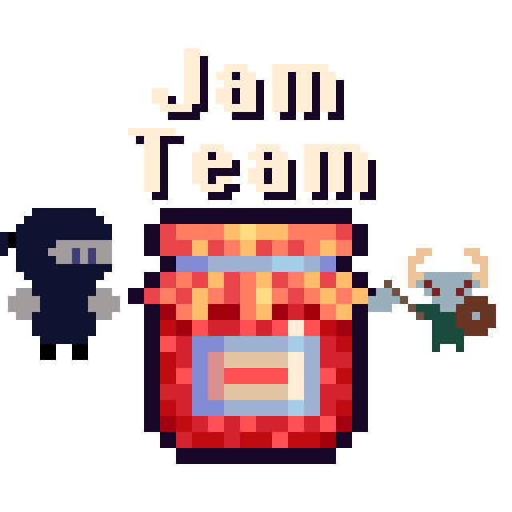

# Welcome to Jam Team!!

    

This README pertains to the January 2024 Boss Rush Jam ([itch.io announcement](https://itch.io/jam/boss-rush-jam-2024#:~:text=You%20have%20one%20month%20to,as%20many%20bosses%20as%20possible.))

#### Current members

- Brett
- Zeamech
- zymkee
- Shiinoya

---

## Pixel Art

Below is the agreed upon characteristics of the pixel art displayed in our game. Before adding or removing things, a PR should be opened along with a discussion with the rest of the team.

Since this is to be done in a month, we must find a sweet spot between looking good and making sure it is doable.

#### If you would like to upload some art..

Please follow guidelines inside the respective art folder (eg. `/sprites`). There will be a README.md file with some annoying instructions :)

### Scene Canvas Size

> To be confirmed

320 x 320 pixels

> Note: This wouldn't meet 16:9 screen ratios. Consider 320 x 180.

### Sprite Size

#### Player Controller (PC) character

> To be confirmed

- Height: Between 24px-32px
- Canvas: 32px-64px

> Note: Depending on the animation, the canvas may need to be 64px.

#### Non Player Controller Characters (NPCs)

> TODO -- will we have any? only bosses are required for the jam

#### Bosses

- Height: 4x-6x PC's height
- Canvas: no hard limit

> Note: Will have to keep in mind that animations will most likely increase the size of the sprite canvas.

#### Weapons

> TODO

#### Items

> TODO

### Color Palette & Theme

> TODO -- waiting on theme announcement from itch.io
